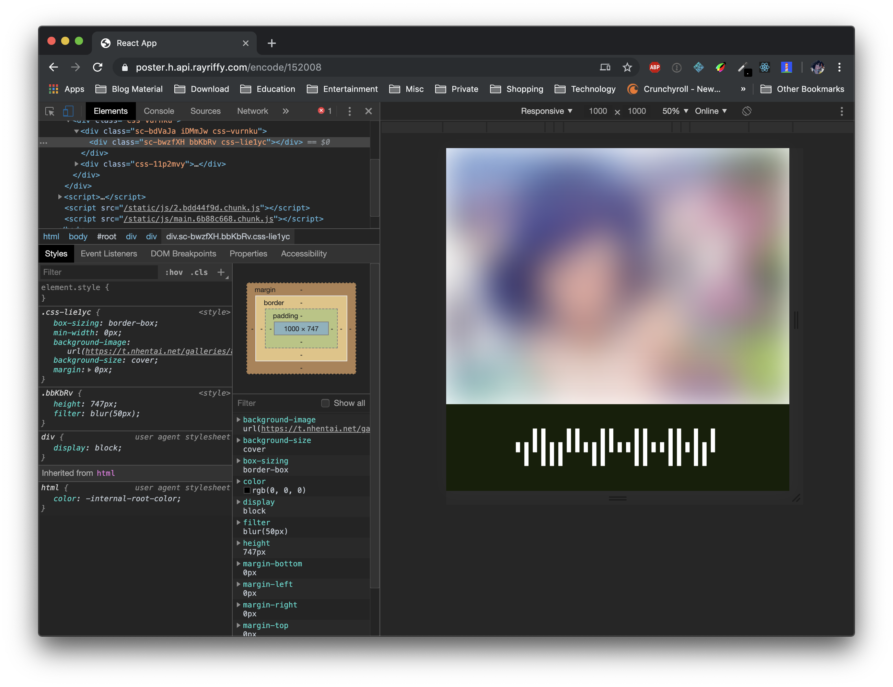

rayriffy-h-poster
=================

Sharing code to socials securely with styled encoded poster

Usage
-----

`https://poster.h.api.rayriffy.com/encode/:id`

Set [puppeteer](https://github.com/GoogleChrome/puppeteer) or screenshot library to obtain the poster with **1000 * 1000 px** viewport and [screenshot](https://pptr.dev/#?product=Puppeteer&show=api-pagescreenshotoptions) it
