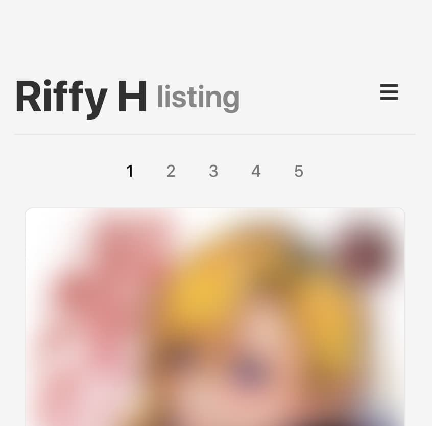
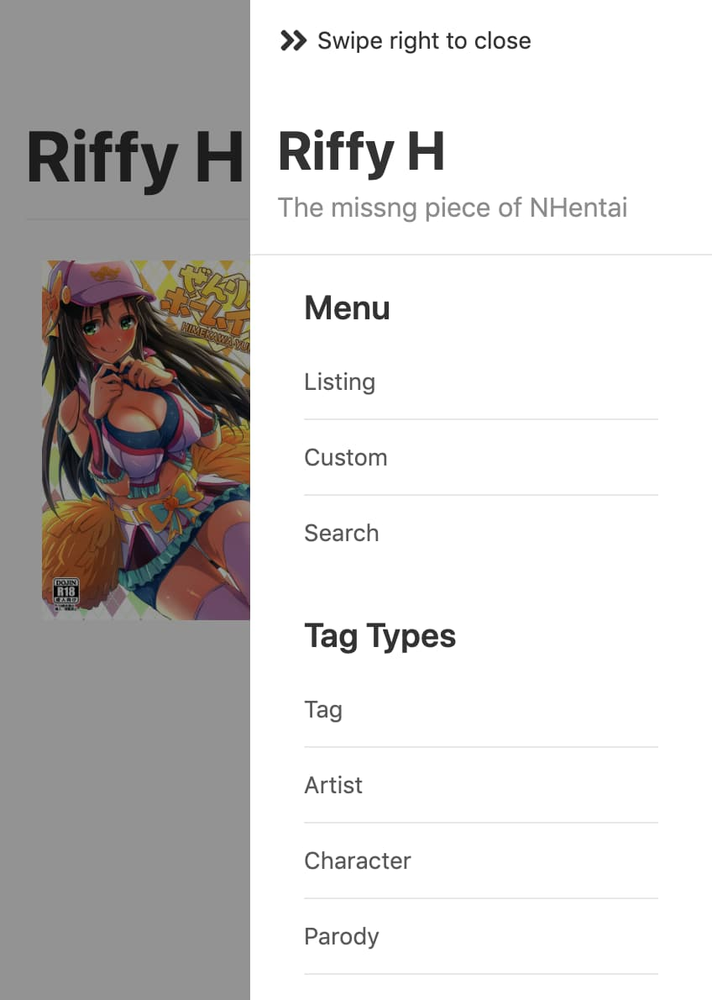

Riffy H
=======

The missing piece of NHentai

Live
----

https://h.rayriffy.com

Feature
-------

- Built with modern **React** API
- Blazing fast browsing powered by **Gatsby v2**
- Custom hentai to any ID that you wish
- **No ads** and **no pop-ups**
- Flexible **search** system
- **Easy to use** collection system
- **Offline-ready** without any interactions

Screenshots
-----------

| Listing                                  | Menu                               | Viewing                                  |
| ---------------------------------------- | ---------------------------------- | ---------------------------------------- |
|  |  |  |

## Browsers support

| [](http://godban.github.io/browsers-support-badges/)<br>IE / Edge | [](http://godban.github.io/browsers-support-badges/)<br>Firefox | [](http://godban.github.io/browsers-support-badges/)<br>Chrome | [](http://godban.github.io/browsers-support-badges/)<br>Safari | [](http://godban.github.io/browsers-support-badges/)<br>iOS Safari |
| --------- | --------- | --------- | --------- | --------- |
| Edge| last 2 versions| last 2 versions| last 2 versions| last 2 versions

Requirements
------------

- Node LTS

Installation
------------

```sh
$ yarn
$ yarn dev
```

Where's all query from
----------------------

Prefetched query data are come from a custom database [here](src/contents/database/codes.js)

Contributing
------------

We welcome all contributions by sending PR to this repository.

Need Help ?
-----------

If you need help with anything, here're following methods:

#### Create an Issue

If you have something you want to discuss in detail, or have hit an issue which you believe others will also have in deployment or development of the system, [opening an issue](https://github.com/rayriffy/rayriffy-h/issues) is the best way to get help. It creates a permanent resource for others wishing to contribute to conversation.
